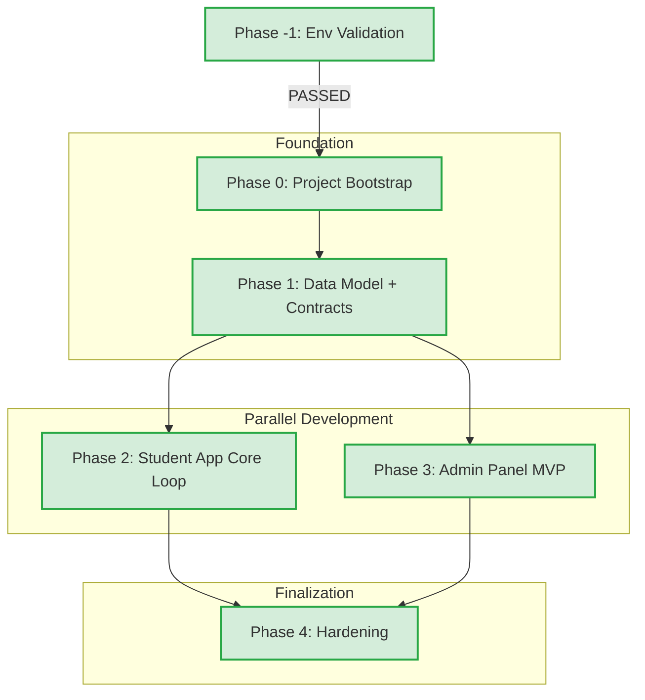

# AppShell Project Roadmap

> **Status**: ACTIVE
> **Current Phase**: Phase 4 (Hardening)

This document visualizes the execution path defined in `AGENTS.md`.

---

## 📅 Timeline & Dependencies

---

## 📍 Milestones

### ✅ Phase -1: Environment Validation (Completed)
- [x] Flutter environment validated
- [x] Node.js environment validated
- [x] Supabase CLI authenticated

### ✅ Phase 0: Project Bootstrap (Completed)
- [x] Initialize `student-app` (Flutter)
- [x] Initialize `admin-panel` (React + Vite)
- [x] Configure linting & tooling
- [x] Set up `.env.example` files
- [x] **Checkpoint**: Validation Script `validate-phase-0.ps1`

### 📋 Phase 1: Data Model + Contracts
- [x] Apply Supabase Schema (`SCHEMA.md`)
- [x] Configure RLS Policies
- [x] Create Seed Scripts
- [x] Verify 7 core tables exist
- [x] **Checkpoint**: Validation Script `validate-phase-1.ps1`

### 📱 Phase 2: Student App Core Loop
- [x] Drift Database Implementation
- [x] Offline Sync Engine (Outbox)
- [x] UI: Domain/Skill Browsing
- [x] UI: Question Runners (5 types)
- [x] Conflict Resolution Logic
- [x] **Checkpoint**: Validation Script `validate-phase-2.ps1`

### 🖥️ Phase 3: Admin Panel MVP
- [x] Admin Authentication (RBAC)
- [x] CRUD: Domains, Skills, Questions
- [x] Atomic Publish Workflow
- [x] JSON Import/Export
- [x] **Checkpoint**: Validation Script `validate-phase-3.ps1`

### ✅ Phase 4: Hardening (Completed)
- [x] Error Handling (Sentry)
- [x] CI/CD Pipelines
- [x] Production Builds
- [x] Final Integration Tests
- [x] **Checkpoint**: Validation Script `validate-phase-4.ps1`

---

## 🛠️ Execution Protocol

1.  **Read State**: Check `PHASE_STATE.json`
2.  **Read Law**: Follow `AGENTS.md`
3.  **Execute**: Do work for current phase
4.  **Validate**: Run validation script
5.  **Update**: Commit state & wait

**Note**: This roadmap is a high-level view. The authoritative source for implementation details is `AGENTS.md`.
