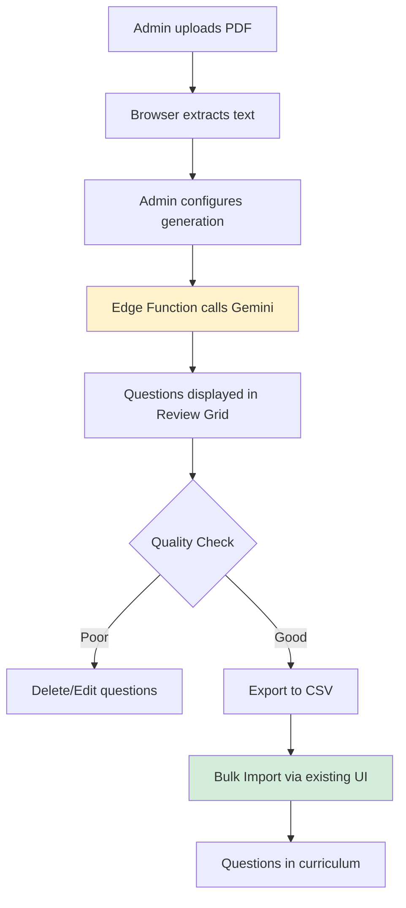

# Phase 11 Implementation Plan: AI-Assisted Content Generation

> **Status**: Active  
> **Phase**: 11  
> **Start Date**: February 4, 2026

## Overview

Phase 11 introduces AI-powered curriculum generation while maintaining the existing quality control workflow. The system leverages modern AI models (Gemini Flash, GPT-4o-mini) to accelerate content creation, with mandatory human review before publication.

---

## ✅ Completed Components

### 1. Database Schema
- **Migration**: `20260204000005_ai_content_generation.sql`
- **Tables**:
  - `source_documents`: Uploaded files (PDF, DOCX, images)
  - `ai_generation_sessions`: AI generation requests and outputs
  - `generation_audit_log`: Cost tracking and debugging
- **RPC**: `mark_session_imported()` for workflow tracking

### 2. Python Infrastructure (content-engine/)
- **DocumentParser**: Extract text from PDF/DOCX/images
- **QuestionGenerator**: AI-powered question generation with Gemini/OpenAI
- **QuestionSchema**: Pydantic validation for database compliance
- **CLI**: Full command-line interface for testing

---

## 🔄 Next Steps: Admin Panel Integration

### Step 1: Browser-Based Document Upload (Priority: HIGH)

**Goal**: Allow admins to upload source documents for processing.

**Implementation**:
1. **UI Component**: `admin-panel/src/features/ai-assistant/components/DocumentUploader.tsx`
   - Use `react-dropzone` for drag-and-drop
   - Accept: PDF, DOCX, PNG, JPEG
   - Upload to Supabase Storage (`ai-source-documents` bucket)
   - Insert metadata into `source_documents` table

2. **Text Extraction** (Client-Side):
   - Install: `pdfjs-dist`, `mammoth`, `papaparse`
   - Extract text in browser (no server cost)
   - Display extracted text for admin review

**Deliverables**:
- [ ] `DocumentUploader.tsx` component
- [ ] Supabase Storage bucket configuration
- [ ] Text extraction utilities

---

### Step 2: AI Generation Interface (Priority: HIGH)

**Goal**: Send extracted text to AI, display generated questions for review.

**Implementation**:
1. **Edge Function**: `supabase/functions/generate-questions/index.ts`
   - Proxy requests to Gemini/OpenAI (protects API keys)
   - Input: `{ text, difficulty_distribution, model }`
   - Output: `{ questions: [], metadata: {} }`

2. **UI Component**: `admin-panel/src/features/ai-assistant/pages/GenerationPage.tsx`
   - Difficulty selector (Easy: 10, Medium: 20, Hard: 10)
   - Custom instructions textarea
   - "Generate Questions" button
   - Loading state with progress indicator

3. **Review Grid**: `admin-panel/src/features/ai-assistant/components/QuestionReviewGrid.tsx`
   - Display generated questions in editable table
   - Delete, Edit, Re-categorize actions
   - Highlight validation errors

**Deliverables**:
- [ ] `generate-questions` Edge Function
- [ ] `GenerationPage.tsx` UI
- [ ] `QuestionReviewGrid.tsx` component
- [ ] Integration with existing `questions` hooks

---

### Step 3: CSV Export & Bulk Import Bridge (Priority: MEDIUM)

**Goal**: Connect AI generation to existing bulk import workflow.

**Implementation**:
1. **Export Logic**: Use `papaparse` to convert reviewed questions to CSV
2. **Download Trigger**: "Export to CSV" button
3. **Workflow**:
   - Admin reviews questions in grid
   - Clicks "Export to CSV"
   - Downloads `questerix_questions_YYYYMMDD.csv`
   - Uses existing "Bulk Import" feature in Questions page

**Deliverables**:
- [ ] CSV export utility
- [ ] Download button with filename generation
- [ ] Documentation update for workflow

---

### Step 4: Session Management & Audit (Priority: LOW)

**Goal**: Track generation history and costs.

**Implementation**:
1. **Sessions List**: `admin-panel/src/features/ai-assistant/pages/SessionsPage.tsx`
   - Table of all `ai_generation_sessions`
   - Columns: Date, Model, Questions Generated, Status, Cost Estimate
   - Filter by status (Reviewing, Approved, Imported)

2. **Cost Calculator**:
   - Estimate based on `token_count` and model pricing
   - Display in UI for transparency

**Deliverables**:
- [ ] `SessionsPage.tsx`
- [ ] Cost calculation utility
- [ ] Audit log viewer (admin-only)

---

## 🎯 Integration Flow



---

## 📦 Dependencies

### Admin Panel
```bash
npm install react-dropzone pdfjs-dist mammoth papaparse @google/generative-ai --legacy-peer-deps
```

### Edge Function
```bash
npm install @google/generative-ai openai
```

---

## 🔐 Security Considerations

1. **API Keys**: Never expose in client code. Use Edge Functions as proxy.
2. **RLS**: All `source_documents` and `ai_generation_sessions` are admin-only.
3. **File Size Limits**: Cap uploads at 10MB to prevent abuse.
4. **Rate Limiting**: Implement per-user limits on generation requests.

---

## 📊 Success Metrics

- **Speed**: Generate 50 questions in < 30 seconds
- **Quality**: 80%+ of generated questions pass human review
- **Cost**: Average < $0.10 per 100 questions (using Gemini Flash)
- **Adoption**: 50%+ of new curriculum created via AI assistant within 3 months

---

## 🚀 Deployment Checklist

- [ ] Apply database migration (`20260204000005_ai_content_generation.sql`)
- [ ] Deploy `generate-questions` Edge Function
- [ ] Create Supabase Storage bucket: `ai-source-documents`
- [ ] Update Admin Panel with new UI components
- [ ] Document workflow in user guide
- [ ] Train admin users on new feature

---

## 📝 Notes

- **Phase 11 Philosophy**: AI accelerates, humans validate. The "Excel Bridge" ensures every question faces human scrutiny.
- **Iterative Improvement**: Start with Gemini Flash. Monitor quality. Upgrade prompts or models as needed.
- **Fallback**: If AI quality degrades, admins can always revert to manual question creation.
